# Microservices Architecture

## Reference Documentation

This project is a summary to the first part of Dimos Raptis's course on Udemy.

It is based primarily on the references below:

* [Microservices Architecture](https://www.udemy.com/course/microservices-architecture/)


### Features

These are the key features that we'll cover in this project:

- Definition of Microservices

- Driving Forces and Conway's Law

- Coupling and Cohesion

- Domain-Driven Design

- Develop/Build/Deploy Spring Boot Microservice locally and to the Cloud

    - Application

        - Build: Maven

        - DI: Spring

        - Web: Spring MVC

        - App Server: Tomcat

        - JSON: Jackson

        - Testing: JUnit/Mockito

    - AWS 
        
        - AWS DynamoDB

        - AWS CLI

        - AWS IAM

        - AWS EC2


## Definition of Microservices

In this section, we'll see what the term Microservice architecture actually means, the fundamental principles and other alternative architecture solutions that exist.

We'll start with the definition of Microservices. We'll see other architectural patterns that existed before and we'll discuss what was the evolution over time.

The definition of Microservices architecture has been a rather controversial topic. Here, we'll explore one of the existing definitions, which defines it as an architectural approach developing a single application as "A suite of small services, each running in its own process, and communicating with lightweight mechanisms".

By the term process here, we can think of a separate process in the operating system. We won't go into details about all the possible communication mechanisms here, since we will be looking into them slightly later. But to give an example, we can think of protocols like HTTP or TCP.

The concept of Microservices is not completely new. Let's have a look at how software architectures have been evolving until the day.

The first and most common architecture used to be the so-called monolith. It's called this way because it is a single unit. So, development is done in a single code base and deployed as such.

On the 90's, a new architecture emerged, called Service Oriented Architecture, or SOA, which motivated the modularization of code into different components that provided distinct business capabilities.

However, usually, all these components were deployed all together in a single code base, maintaining the basic characteristic of the monolith. 

At the start of the 20th century, these components started being splitted even further into individually deployable code bases which were called microservices.

As discussed previously, the monolith was a single code base.

Often though, this code base was split into 3 main parts.

The Data Tier consisted usually of relational database system, which contained the data of the application.

The Logic Tier was the monolith, and contained all the actual business logic of the application.

The Presentation Tier was supposed to be a very thin layer which did not contain any business logic, but only contained templates used to define how data would be shown to the user.

The main drawback of this architecture was that different business concepts were intermixed in the same code base. Thus making it very complex and hard to maintain.

As a result, in order to make the code more modular and maintainable, people started adopting the idea of splitting the various business concepts in different software components, which provided explicit interfaces to each other.
 
This helped a lot making the software more maintainable, but all these components were usually still deployed as a single unit, talking to a single database.

This meant that it was difficult to scale selectively only some business capabilities even needed.

Furthermore, the fact that all the code resided in a single code base usually led to components that were aware of each others implementation details, which made them harder to understand and less flexible.

We can see a very simple example here, where the various capabilities, such as Accounting, or Sales, are splitted into independent software components. They all store their data in a single database, ideally in different tables, and they are deployed as a single unit.

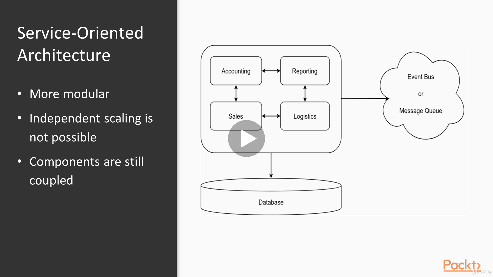

SOA Architectural Model, by Dimos Raptis, [Udemy](https://www.udemy.com/course/microservices-architecture/).

So, the next step people started considering was splitting these components further into individually deployable services.

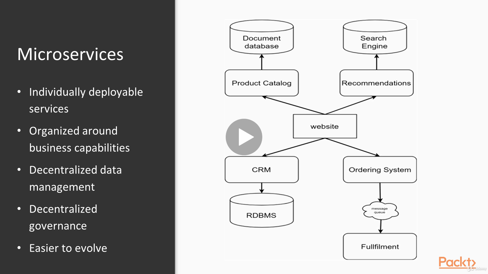

Microservices Architectural Model, by Dimos Raptis, [Udemy](https://www.udemy.com/course/microservices-architecture/).

As mentionied previously, each of those services usually was serving a specific business need.

This allowed different business units to manage their data individually and not be affected by requirements of other units.

It also made for a more descentralized governance, allowing each team to select programming languages and storage systems according to their needs.

It was also much easier to evolve its system, since its team could develop and deploy their software independently.

As shown in the diagram, the capabilities are now splitted in completely separate services which are deployed separately and each has its own storage system which ideally is not accessible at all to other services.


## Driving Forces and Conway's Law

In this section, we will analyze what are the main driving forces that contributed the most to the wide adoption of the microservices architecture.

As mentioned previously, the adoption of the Microservices architecture has been supported significantly by other changes that were happening in the software industry in the same period.


### Driving Forces


- DevOps

- NoSQL and Polyglot Persistence

- Public Cloud Providers

- Serverless Computing


So, we will try to understand each of these factors separately and understand its relationship to the Microservices Architecture.


### DevOps

DevOps is a software engineering culture and a set of practices that aim to unify Software Development and Software Operations.

Its ultimate goal is being able to to deliver applications and services at a high velocity while also ensuring high quality.

The starting point in adopting a DevOps model is removing any existing silos between the Development team and other teams, such as Operations, Quality Assurance, or Security, and create an environment where these teams work together throughout the application lifecycle.

By having developers working together with operators, they can exchange knowledge and create a product that is both easier to develop and operate.

The major practices of DevOps are:
	
- Continuous Integration (CI) - The practice of merging all code changes of Developers to a Code Repository (CR) copy as frequently as possible. 

- Continuous Delivery (CD) - builds on CI and is the practice of producing software in small cycles which can be reliably released at any time.

- Infrastructure as code (IAC) - is a process of managing and provisioning computing resources via machine readable definition files.

- Monitoring and Logging is crucial for being able to detect and mitigate software defects quickly and easy.

- Communication and Collaboration

Following the DevOps model facilitates significantly the development and operation of a Microservice architecture.


### Polyglot Persistence


- Access Pattern

- Transactional Semantics

- Durability

- Availability


Polyglot Persistence is the idea of using different data storage technologies according to the occasion.

People sometimes tend to categorize data storage technologies into two main classes: SQL and NoSQL.

But as seen in the diagram, there are many different types of data stores, such as Key-Value Store; Graph Databases; Message Queues, etc.

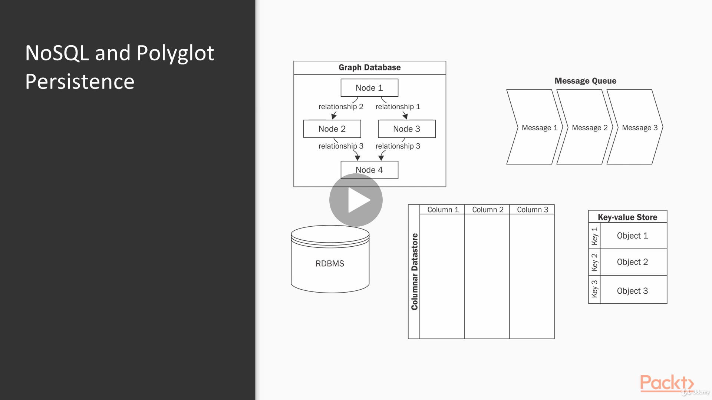

Polyglot Persistence Diagram, by Dimos Raptis, [Udemy](https://www.udemy.com/course/microservices-architecture/).

The decision of which technology to use depends on several factors. A key factor is the Access Pattern we want to optimize for.

For instance, if we want to access specific objects by their unique identifier, a Key-Value Store might be the most suitable. 

Another factor is the Transactional Semantics we need. So, if for example we need full ACID transactions, then a Relational Database could be the right fit.

A Microservice Architecture enables us to leverage the concept of Polyglot Persistence, and using a different data source for each service, according to our needs.


### Public Cloud Providers

- Economy of Scale

- Pay-As-You-Go Model

- Elasticity

- Better Utilization Rates

- Better Reliability, Security

- Avoid Reinventing the Whell


Nowadays, there are many companies that provide Public Cloud services. Leveraging one of these Public Cloud Providers, instead of building a Private Cloud, has several benefits.

First of all, economies of scale decrease the cost per computing unit and the Pay-As-You-Go model allows small companies and startups with limited budgets to build products without compromising on quality.

Cloud Providers also provide Elasticity, which makes it easier and faster to scale specific parts of a system.

Last but not least, most of these providers have offerings that give basic capabilities, reducing the need to reinvent the wheel.

For all these reasons, developing a Microservice architecture in the Public Cloud is much easier and cost effective.


### Serverless Computing


- A Cloud Computing execution model in which the Cloud Provider dynamically manages the allocation of machine resources.

- Pricing is based on the actual amount of resources consumed by any application, rather than on pre-purchased units of capacity.

We should notice that the word Serverless is kind of a misnomer here, since this model still requires servers that are simply not managed by the Developer or the Operator.

This model has several benefits:

- Reduced costs - by eliminating idle resources

- Operations/Scalability - Significant reduction of Operations and automation of scaling processes.

- Productivity - increased productivity, since Developers usually don't have to worry about infrastructural concerns and have to write much less code.

In a Microservices Architecture, it's easier to take advantage of Serverless Computing and use it only when appropriate.


### Conway's Law


Another important benefit of the Microservices Architecture which is often neglected is the ability to improve an organization's communication mechanisms and efficiency.

The Conway's Law states that "Any organization that designs a system will produce a design whose structure is a copy of the organization's communication structure".

How is this relevant to the Microservices Architecture?

As described in the previous section, a monolithic application is one where all developers work in a single code base. We can easily see how that does not scale very well as an organization grows. However, a Microservices Architecture is based on multiple services communicating via clearly defined interfaces.

This ties very well with an organization composed of multiple teams perhaps located in different places where teams would be able to work independently, removing any unneeded communication overhead.


## Coupling and Cohesion


### Coupling

In software engineering, Coupling is the degree of interdependence between software modules.

In other words, a measure of how closely connected to modules our routines are.

First of all, we should make it clear that Coupling is not necessarily a bad thing.

A small amount of coupling is necessary, so that a component can leverage the funcionality provided by another component.

However, high degrees of Coupling are undesired, because they can make software more complex and less maintainable.

Let's see an example of how to understand better what's the difference between tight and loose Coupling.

Let's assume we have a component which can be used to execute payments, so that a customer can buy a product.

Initially, our software only needs to handle payments by debit cards.

As shown in the sample code below, the PaymentProcessor is making use of a DebitCard to complete the transaction. 

- Tight Coupling - Example
```
    public class PaymentProcessor {

        private DebitCard card;

        public Receipt pay(Money amount, Account from, Account to) {
            if (card.hasBalance(amount)) {
                card.transfer(amount, from, to);
                // more logic
            }
            return null;
        }

    }

    public class DebitCard {
        
        public boolean hasBalance(Money amount) {
            // ...
            return false;
        }

        public void transfer(Money amount, Account from, Account to) {
            // ...
        }
    }
```
Knowing we'll probably need to support more payment methods in the future, we would say that the PaymentProcessor is tightly coupled to the DebitCard component.

To realize why that, let's try to imagine how this code would look like when we start adding funcionality to support new payment methods.

We would probably need to write a lot of conditional code for each different type, thus making harder to read.

Furthermore, does the PaymentProcessor really need to know all the payment methods that currently exist?

Let's see an alternative design.

In the example below, we see that we've created a common interface for all the possible payment methods.
```
    public class PaymentProcessor {
        
        
        public Receipt pay(Money amount, Account from, Account to, PaymentMethod method) {
            if (method.canPay(amount)) {
                method.pay(amount, from, to) {
                    // more logic
                }
            }
        }

    }

    public interface PaymentMethod {

        public boolean canPay(Money amount);

        public void pay(Money amount, Account from, Account to);

    }
```
The main capabilities that we decided every payment method should have is the ability to determine whether the payment can be done and the ability to do a payment.

It is Payment that implements that interface (PaymentMethod) in a different way.

For example, the DebitCard pays via a bank transfer while an electronic check is redeemed.

In this way, the PaymentProcessor does not need to know about all the payment methods that exist. It only knows about the interface that it uses to execute the payment.

Also we are able to add a new PaymentMethod without changing the PaymentProcessor at all.

In other words, the PaymentProcessor is loosely coupled to the PaymentMethod.

We have to know though that all the PaymentMethod's should be able to comply with the interface we defined.

What we did is sometimes called Programming to the Interface or Dependency Inversion.

The former means that we try to understand what exactly we needed from a business perspective and we created an interface on this capability which we then use.

The latter means instead of making the PaymentProcessor depend on all the existing PaymentMethod's, we created an inverse dependence: we make the PaymentProcessor dependent on the PaymentMethod interface, and then we made all the payment methods dependent on that interface.

Here, we can see some of the benefits we can get from making the components being loosely coupled to each other. As we observed previously, it is easier to extend and add new capabilities to the components that are loosely coupled.

It is also easier to reason about the overall system and maintain it, since interaction between components tend to be more lightweight and intuitive.

It is also easier to replace or deprecate parts of the system or perform migrations, since components are less dependent on each other.

As a plus, programming to the interface encourages thinking in terms of business concepts and encourages reuse.


### Cohesion

In computer engineering, Cohesion refers to the degree to which the elements inside the module belong together.

Again, Cohesion is not a binary value, but there is a whole spectrum of different types of Cohesion.

For example, some of the worst types of Cohesion are coincidental in Temporal Cohesion, while a really good form is form is the Functional Cohesion.

In the context of this course, we will try to simplify things a bit and we will try to talk about systems and components that have either High or Low Cohesion.

Let's see another example.

Here, in the snippet code below, we can see a component called CustomerService. As you can probably easily notice, this component is not highly cohesive, since it accomplishes too many business capabilities that are quite irrelevant.
```
    public class CustomerService {

        public Address getAddress(Customer customer) {
            // ...
            return null;
        }

        public Receipt pay(Money amount, Customer payer) {
            // ...
            return null;
        }

        public void deliver(Package package, Customer toCustomer) {
            // ...

        }

        public void notifyOrderStatus(Order order, Customer customer) {
            // ...

        }

        public void notifyAboutPromotions(Customer customer) {
            // ...
        }

    }
```
One could argue that all the functionalities are relevant to a Customer. However, this is probably not the right granularity to split components on, since there are too many functionalities related on the Customer.

This component code will not be focused, which will make it harder to understand from developers reading the code.

It will also be harder for people to identify a specific part or functionality or change a part without breaking any client.

Let's see an alternative design.
```
    public class CustomerService {

        public Address getAddress(Customer customer) {
            // ...
        }

        public String getEmail(Customer customer) {
            // ...
        }

    }

    public class PaymentService {

        public Receipt charge(Customer customer, Amount amount) {
            // ...
        }

    }

    public class DeliveryService {

        public void deliver(Package package, Address address) {
            // ...
        }

    }

    public class NotificationService {

        public void notify(String email, String message) {
            // ...
        }

    }
```
In an effor to split and group alternative capabilities, we came up with four different services: one for retrieving basic Customer info; one for executing Payments; one for executing Deliveries; and one for Notifications.

As we can see here, the responsability of each component is much more focused. As a result, it is easier to understand what each component does and identify which of the components we should use according to our needs.

As a plus again, we can observe that this class structure reflects better the business domain.

Having highly cohesive components has a lot of benefits. The main which are: 

- Increased clarity and ease of comprehension - by having smaller and more focused components

- Enhanced maintainability and extensibility - because when responsibilities are divided better, changes tend to affect fewer modules.

- Promotes loose coupling - also, having highly cohesive components makes it much easier to connect them in a loosely coupled way.

So, Coupling and Cohesion are two very crucial aspects that can help us make our software maintainable and flexible.

This is important when we talk about the different parts in the same codebase. However, it is evem more important when we are talking about completely separate systems, since an interface that is used externally by multiple services is much harder to change when compared for instance which is only used internally in a packet.

So when introducing a new service into our Microservices Architecture, it is vital to make sure that it will be highly cohesive by solving a specific problem or providing a focused set of capabilities.

What's more, we also need to ensure that it won't expose any implementation details and will provide a clean interface so that its clients will be loosely coupled to it.


## Domain-Driven Design

Domain-Driven Design is an approach to software development for complex needs by connecting the implementation to an evolving (business) model.

The fundamental principle of Domain-Driven Design is that by putting effort into trying to understand deeply the business domain of the problem we are trying to solve, we are able to remove complexity from the produced software, thus making it easier to understand and extend.

Domain-Driven Design is not a technology or a standard.

It is more likely a set of basic concepts and practices for making design decisions.

Let's explore the more basic concepts first.


### Domain

The Domain of the software is the sphere of knowledge in the subject area on which the software is created.

For instance, Physics could be the domain of software system for simulation.


### Model

The Model is a representation of the Domain, a set of abstractions that describe some aspects of the Domain, such as the main entities and relationships between them.

For example, when modeling a chess game via software, we are creating classes for the various pieces and for the rules that govern how each of them can move.

### Ubiquitous Language

The Ubiquitous Language is a core part of the Domain-Driven Design. The communication between software developers and other people such as Product Managers or even Customers is hard an often leads to misunderstandings.

This can have serious implications such as software that is hard to understand or even software that is not doing what it needs.

The main idea is to create a vocabulary with Developers to use when communicating with other teams where everyone has agreed on what each term means.

This triggers a lot of communication which can help Developers better understand what they have to build.

In an ideal scenario, this vocabulary is also visible in the code itself, thus making it much easier to reason about.


### Context

	
A Context is the setting in which a word or a statement appears that determines its meaning.

As we'll see later, in a business Domain, there can be multiple Contexts, and a single word can have different meanings on every context.


The concepts we saw previously were high level. Now we'll look into some lower level building blocks which can be used in the implementation part.

- Entity - An Entity is an object that is not defined by its attributes but rather by its identity. An example could be two employees that both the same salary, role and whatnot, but they are identified by the employee number.

- Value - On the other hand, a Value is an object that contains attributes, but has no conceptual identity. For instance, two business cards are no distinguishable if the text on them is the same.


We should notice that whether an object is an Entity or a Value can also depend on the Context.

For example, for the factory that produces these cards, they are actually two different products.

It is really important to determine whether something is an Entity or a Value, because each type has different characteristics and effects on our systems.


- Repository - The Repository is a component used for retrieving Domain objects. It can encapsulate and hide the underlying storage technology, so the clients are agnostic to it. 

Domain objects do not have to be plain data holders, but can also have business functionality.

For instance, a Customer object can contain all the data for a Customer, but can also have functionality, such as methods determining whether the Customer is eligible for studying.


### Service

Service is a component that provides some business functionality which does not belong conceptually to any other domain object.

Repositories and Services can help us keep business and infrastructure code completely separate.


### Domain Event

A Domain Event is an object that defines something that happened. 

To give an example, if we have an online store, we might want to represent the fact that a Customer made an order by a separate Event Object. It can be important sometimes to explicitly represent activities as objects and not just as methods that change some state.

This is due to the fact that usually domains contain quite complex workflows that is very helpful to model in software via Events.


### Bounded Context

The concept of Bounded Context is one of the central parts of DDD and the one that is most relevant to the Microservices Architecture.

As we described previously, we are trying to build a conceptual model of the Business Domain to facilitate our understanding and communication.

However, large domains contain a lot of concepts which are used in multiple contexts.

They did recognize that having a single unified model for such Domains is if not impossible, very costly.

One practice that is used in Domain-Driven Design to deal with this is splitting the Domain in multiple Bonded Contexts, where we can build a separate model for each one.

To give an example, for an e-commerce company, the word Account can have different meanings depending on which people we're talking about.

The software that is used by Accounting Systems will probably need to know about the balance of a Customer's Account.

On the other hand, systems in Customer Support would need the email of a Customer Account, and perhaps the order history.

But the Account Balance would be irrelevant in that Context.

Understanding the various Bounded Contexts in our Domain can helps determine what kind of Microservice we have to build.

In our previous example, the two Bounded Contexts map One to One two different Microservices.

When communicating, these two systems should create a shared model which contains only the necessary information for both Contexts and nothing more.

By doing that, we make sure that the two systems remain as loosely coupled as possible while by identifying the Bounded Contexts, we make sure that each Microservice will be as cohesive as possible.


### Why Should We Use DDD in a Microservices Architecture?

There are two main reasons.

First of all, as we saw, DDD places the focus on the Business Domain. So, it can helps us define the boundaries of responsibility for each Microservice.

Hopefully, we can understand how the Bounded Context previously discussed can be useful to us.

Furthermore, we notice that DDD also puts a big emphasis on efficient communication between people.

Let us remind that one of the biggest driving factors for adopting a Microservices Architecture is the opportunity to manage a very big organization by partitioning it into smaller teams.

The distributed nature of Microservices can create silos and hinder communication.

DDD is a valuable tool in our arsenal in order to prevent that.


## Exploring our Sample Project


In this section, we'll introduce a business problem or even better a business opportunity.

We'll analyze the Domain using the ideas from DDD and try to design a Microservice Architecture using some of the practices taught so far.

So, let's imagine our company is a music production and distribution giant in the music industry.

It identifies the best talents in the world, signs contracts with them, helps them to produce top quality content and then makes their content available online and easily discovarable by all the music enthusiasts accross the globe.

The first thing we have to do is understand our business.

And what's the best way to do that?

Communication, of course.

So, we start out with a lot people around the company, discussed and made the following diagram, depicting the general flow.

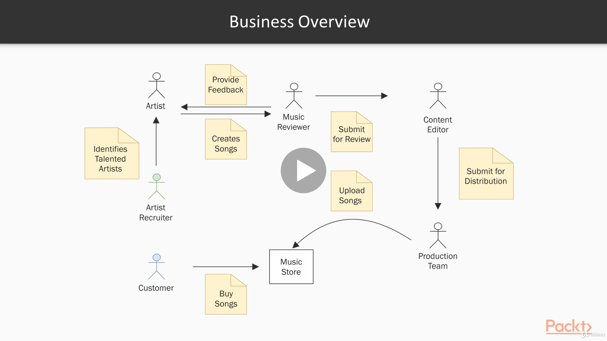

Business Overview Diagram, by Dimos Raptis, [Udemy](https://www.udemy.com/course/microservices-architecture/).

As we explained previously, an intuitive and helpful way of analysing the business space and identifying the various parts is by identifying the main Domain Events, which we've done here.

We've ommited a lot of parts of the business in the diagram for simplicity.

As we can see, the journey starts from identifying the right artists and helping them to produce high quality content by providing feedback via a review committee and enhancing their songs via a specialized editing team.

The production team is then responsible for preparing the songs for distribution.

After that process is complete, the customer is able to discover and purchase a new song.

As we discussed earlier, this Domain is rather complex, and is expected to contain several Bounded Contexts. 

Discovering these Contexts will be very helpful for structuring our architecture.

We'd also want to reiterate that the same word can mean different things in different Contexts.

For example, the word Client can refer to an artist in the Context of Content Review, but it can refer to a potential Customer in the Context of Sales.

A coarse grain separation of Contexts could be done by using the Persons in the diagram.

For example, Content Review, Content Editing, Content Production, etc.

However, as said, we've ommited some details, so there are probably many more Contexts we'd have missed, and that's acceptable in our case. For instance, Production is probably composed of many more teams.

The next step would be to structure our organization according to these Bounded Contexts and let each team work on building services wich will coordinate for an overarching purpose.


### Architecture

Here, we'll assume we are part of a sub team called Publishing and Discovery team.

Our mission is to build the systems which are responsible for publishing new songs and making them available to customers.

As always, the design of a system starts from the requirements.

So, we will give some basic requirements here to drive our design.

- Our system should be able to accept requests for publishing a new song both manually and programmatically.

- Customers should also be able to share the already published songs either by referencing a specific song or by other criteria such as by artist or by publication date.

- All this should ideally be done with a very low latency and the criteria should be easily extensible.

So, let's start by our first service, which we will call Catalog Service, since it will be responsible for maintaining a catalog of the published songs.


This service will expose two endpoints: one for publishing a song and one for retrieving a specific song by its identifier.

In order to store the data, we will use a Key-Value Store to store the songs information and another storage system to store the artifacts of the song, the actual audio file.

Since we have Customers accross the globe, we'll also have a Content Delivery Network (CDN) in front of the Object Storage system, so that the audio files are casting locations close to the Customers.

Of course all these data stores should be invisible outside that service, since it will encapsulated behind the service's clean interfaces.

However, this service is capable of retrieving a song having their identifier.

We said we also need something along the lines of: "find me the latest releases". We will use a different service responsible for maintaining these views.

We will be producing Events for a song's publication to a Message Queue. In this way, we'll reduce the coupling and new services can easily be attached to this source of Events and process them however they like.

For start, we will create one more service, called Discovery Service, which will be responsible for consuming the messages and building an index of the published songs.

In the same way, the service will provide the necessary endpoints to query the data in different dimensions.

So, clients will be unware of which is the underlying technology where the data is stored.

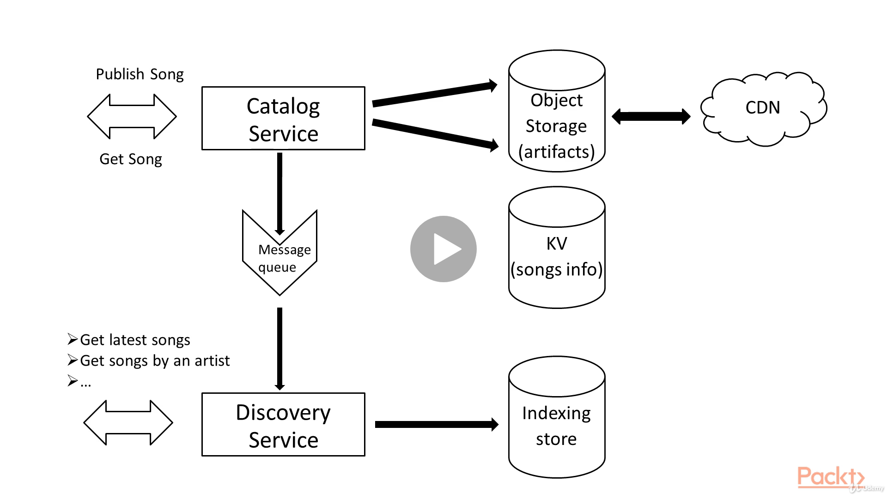

Project Architecture, by Dimos Raptis, [Udemy](https://www.udemy.com/course/microservices-architecture/).


## Building Our First Microservice

In this first part, we'll take the design we've created on the previous section and we will start by building our first Microservice and deploying it on the Cloud.

Reminding what we discussed in the previous section, we need to build a Catalog Service, which will be responsible for storing new songs and for retrieving songs that have already been published.

Each song will have several attributes, such as the author of the song, the duration of the song, and location where it is stored, etc.

Each song will also have a unique identifier which will be used to retrieve it.

We will use the REST Architectural Pattern to structure our endpoints in order to optimize for interoperability.

As we can see, the retrieval of a song will be achieved via an HTTP Get request, where the ID is encoded in the URL, while storing a new song will be done via an HTTP Post request, with the song's data contained in the request's body.

Since we need really efficient storage and retrieval of songs we will use a distributed Key-Value store called DynamoDB.

We should notice that we have to make sure that clients should be informed if they try to store a song with an ID that already exists.

DynamoDB, as most distributed databases, does not provide ACID transactions, but it provides conditional operations which will liberate us for that purpose.


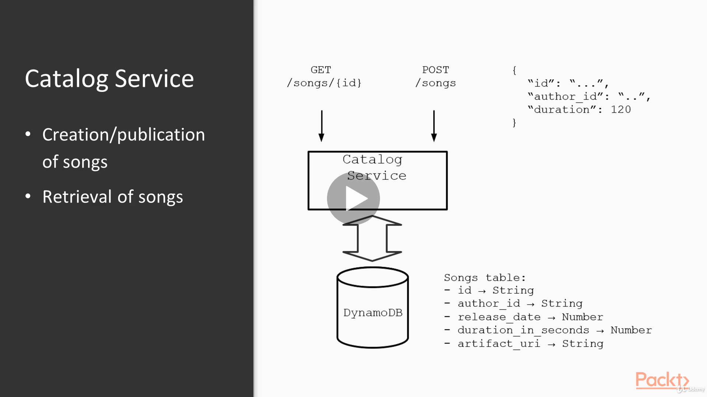

Catalog Microservice Endpoints, by Dimos Raptis, [Udemy](https://www.udemy.com/course/microservices-architecture/).


### Our Tools


Let's first have a look on the tools we'll use.

We'll use Maven as our build system and for dependency management.

We'll use Spring for Dependecy Injection and Spring MVC to expose our Http endpoints.

We'll use Tomcat as an application server.

As we saw previously, we'll use Json for serialization and Jackson is the library that will help us to do that.

Finally, for testing, we'll make use of JUnit and Mockito.

The Spring Controller will be the entry point of our service, accepting the Http requests.

The Controller will use the Songs repository to store and retrieve the associated song.

We should notice that in most cases there is an intermediary Service Component responsible for aggregating the main business logic.

But in our case, we don't have significant business logic, so we'll skip that for simplicity. We should notice that in most cases there is an intermediary Service Component responsible for aggregating the main business logic.

But in our case, we don't have significant business logic, so we'll skip that for simplicity.

We also have these two main classes: Song and SongItem.

We need to pay some attention here to understand the difference between them. The DynamoDBSongItem is the data holder only used for interacting with our data store, while the Song class belong to our core Domain, and could also have additional business logic in a more realistic example.

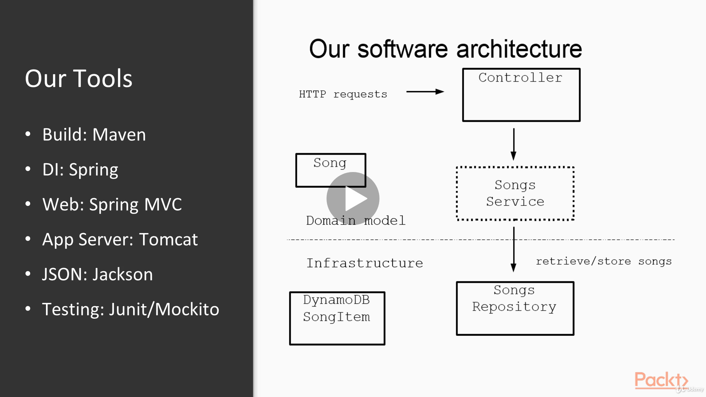

Catalog Microservice Architecture, by Dimos Raptis, [Udemy](https://www.udemy.com/course/microservices-architecture/).


## Spinning Up Our First Microservice


Let's have a look on the code.

As we've mentioned previously, our entry point is the Controller. We can see here that there are two main methods: one for getting a Song and one for publishing a Song.
```
    @RequestMapping(value = "songs/{song_id}",
            method = RequestMethod.GET,
            produces = MediaType.APPLICATION_JSON_VALUE)
    public ResponseEntity<?> getSong(@PathVariable("song_id") String songIdentifier, ModelMap model) {
        final Optional<Song> song = songsRepository.getSong(songIdentifier);
        if (!song.isPresent()) {
            return new ResponseEntity(HttpStatus.NOT_FOUND);
        }
        final String jsonResponse = song.get().toJson();
        return new ResponseEntity<>(jsonResponse, HttpStatus.OK);
    }

    @RequestMapping(value = {"/songs"},
            method = RequestMethod.POST,
            produces = MediaType.APPLICATION_JSON_VALUE)
    @ResponseBody
    public ResponseEntity<?> publishSong(@RequestBody String jsonPayload) {
        try {
            final Song song = Song.fromJson(jsonPayload);
            songsRepository.storeSong(song);
            return new ResponseEntity<>(HttpStatus.CREATED);
        } catch(SongIdentifierExistsException e) {
            final String jsonMessage = String.format("{ message: \"%s\" }", e.getMessage());
            return new ResponseEntity<>(jsonMessage, HttpStatus.BAD_REQUEST);
        }
    }
```
This Component is a thin wrapper which calls immediately the SongsRepository.

In the same logic, the repository contains two methods: one for getting a Song by its identifier and another one for storing a new Song.
```
    public Optional<Song> getSong(final String songIdentifier) {
        DynamoDBSongItem songItem = dynamoDBMapper.load(DynamoDBSongItem.class, songIdentifier);
        if (songItem == null) {
            return Optional.empty();
        }
        return Optional.of(songItem.toSong());
    }

    public void storeSong(final Song song) {
        final DynamoDBSongItem dynamoDBSongItem = DynamoDBSongItem.fromSong(song);
        final DynamoDBSaveExpression dynamoDBSaveExpression = getSongIdDoesNotExistExpression();
        try {
            dynamoDBMapper.save(dynamoDBSongItem, dynamoDBSaveExpression);
        } catch (ConditionalCheckFailedException e) {
            throw new SongIdentifierExistsException(song.getId());
        }
    }
```
For that, it's using the DynamoDBSongItem, which as we've mentioned before, is a data holder.

The most important aspect is the Dependency Injection, which is the process by which all the necessary components are instantiated when the application starts.

We can find that in the MainConfiguration class. We can see that there is one method for each component marked with a @Bean annotation, which defines how the component will be instantiated. The most important thing here is how we can differentiate for various environments.

For instance, we can see here that we will be using a different instance of DynamoDB depending on whether we are in Development or Production environment.
```
    private AmazonDynamoDB getDynamoDB() {
        final String stage = environment.getProperty(STAGE_PROPERTY_NAME);
        final String region = environment.getProperty(REGION_PROPERTY_NAME);
        switch (stage) {
            case "dev":
                return AmazonDynamoDBClientBuilder.standard()   
                        .withEndpointConfiguration(new EndpointConfiguration("http://localhost:8000", region))
                        .build();
            case "prod":
                return AmazonDynamoDBClientBuilder.standard()
                        .withRegion(region)
                        .build();
            default:
                throw new RuntimeException("Stage defined in properties unknown: " + stage);
        }
    }
```

### Local Deployment

This section shows how we can run locally the application, communicating with a local DynamoDB instance.

### Pre-requisites

We can download the local DynamoDB library here: https://docs.aws.amazon.com/amazondynamodb/latest/developerguide/DynamoDBLocal.html


Then we go to the folder we downloaded the DynamoDB library provided by AWS and start the database with the following command:
```
java -Djava.library.path=./DynamoDBLocal_lib -jar DynamoDBLocal.jar -inMemory
```

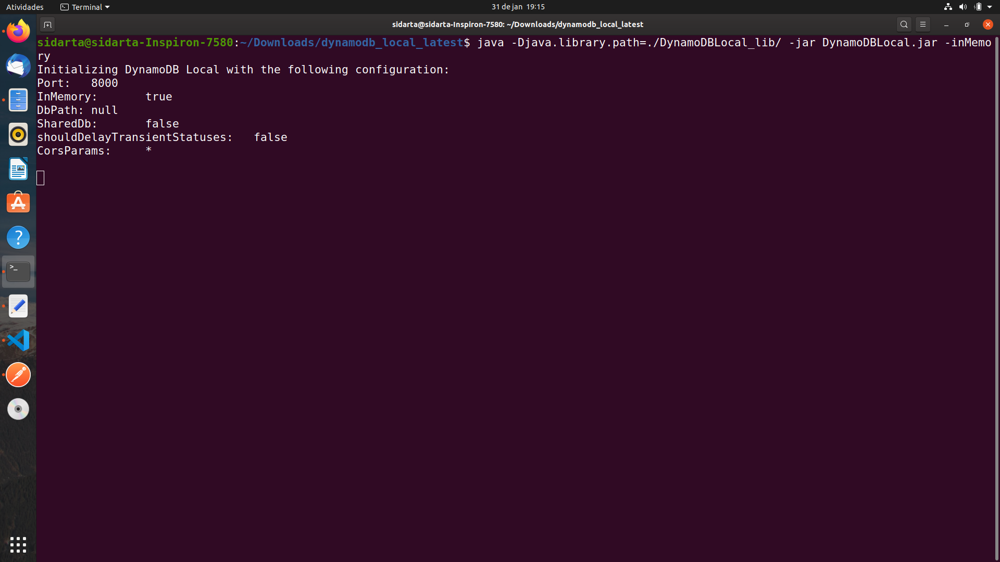


Next, we should create the DynamoDB table (named as songs) with the following command:

```
aws dynamodb create-table --endpoint-url http://localhost:8000 --table-name songs --key-schema AttributeName=id,KeyType=HASH --attribute-definitions AttributeName=id,AttributeType=S --provisioned-throughput ReadCapacityUnits=100,WriteCapacityUnits=100
```


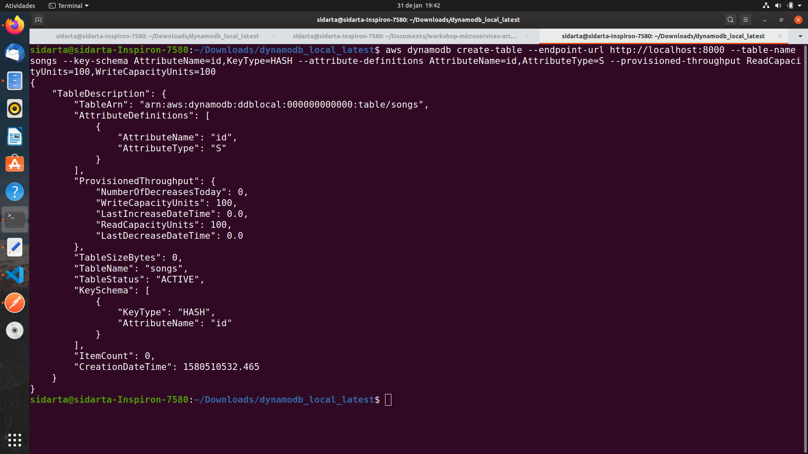


We should take into account that the AWS CLI should already have been installed in our machine. We can install it on Ubuntu with the following command:
```
sudo pip install awscli
```

After that, we can finally start our Microservice application (with development profile) running the following Maven commands:

```
cd application_folder
mvn clean install
mvn tomcat7:run -Dspring.profiles.active=dev
```

### Testing Locally


#### Creating a New Song

            1. Open Postman REST Client

            5. Enter
                    {									
                        "id" : "id_2",
                        "author_id" : "author_id_2",
                        "release_date" : "2526070251333",
                        "duration_in_seconds" : 250,
                        "artifact_uri" : "s3://bucket/song2.mp4"

                    }

            4. Click Send

            5. Check if we are getting HTTP 201 Created


Now, if we do one more request with the same identifier, we get a 400 error code with a message saying that the identifier already exists. As we described previously, we cannot store a Song with the same identifier twice.

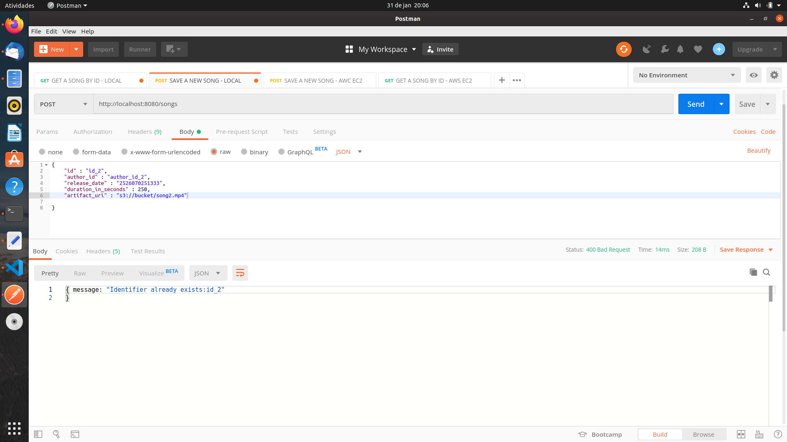


#### Retrieving a Song by Id

            1. Open Postman REST Client

            2. Enter the URL: http://localhost:8080/songs/id_2

            3. Select GET as HTTP method

            4. Click Send

            5. Check if we are getting HTTP 200 OK

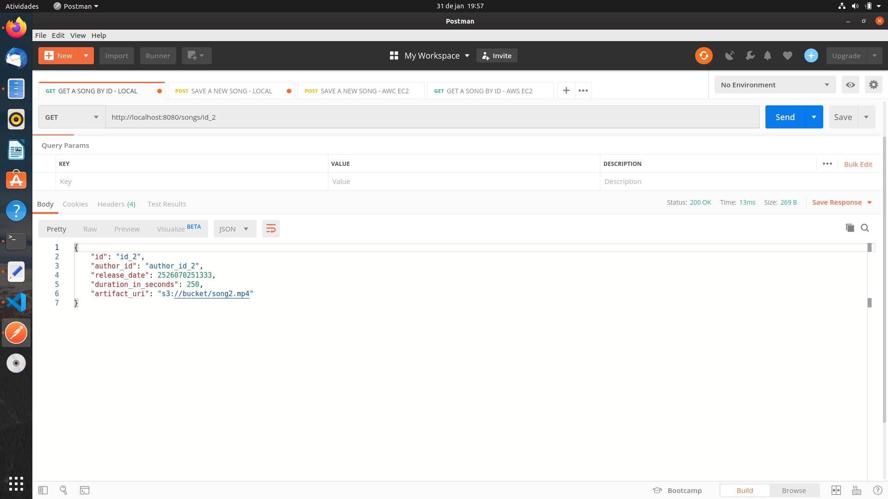


Now that we confirmed that our Microservice works as expected, let's deploy to the Cloud.


### Production Deployment


We'll use the AWS Cloud, so we must have created an AWS account.

#### Create an EC2 Keypair

- Create the key from the AWS console and store the private key locally as `EC2_instance_key.pem`

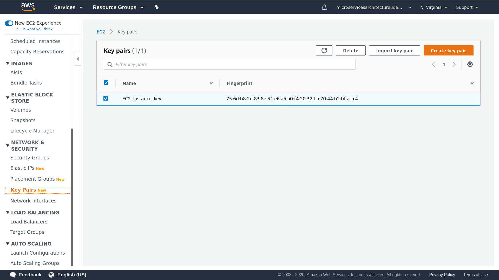

- Restrict the permissions in the file
```
chmod 600 EC2_instance_key.pem
```

#### Create a New User

- Create a new User with the following permissions:

    - DynamoDB:CreateTable
    - IAM:PassRole
    - IAM:CreateRole
    - IAM:CreateInstanceProfile
    - IAM:AddRoleToInstanceProfile
    - IAM:PutRolePolicy
    - EC2:AuthorizeSecurityGroupIngress
    - EC2:CreateSecurityGroup

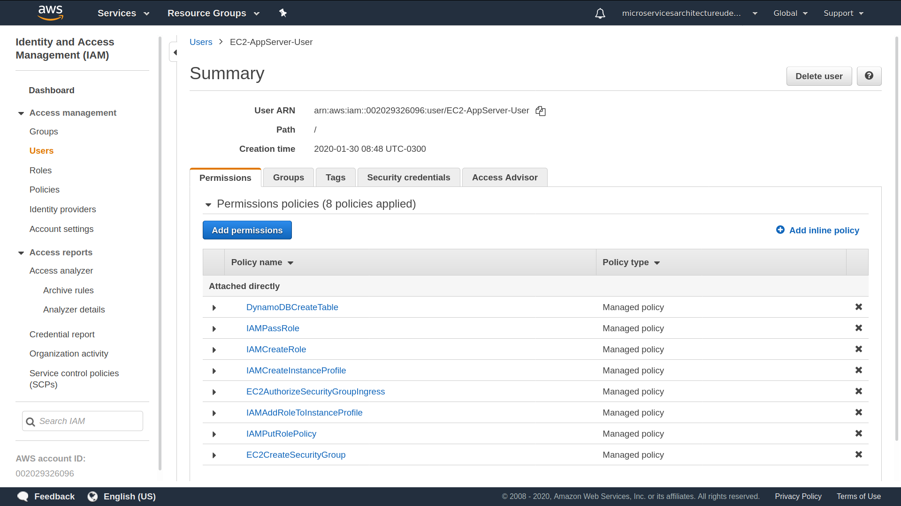


#### Create IAM Role (for EC2) to Access DynamoDB

- Execute the following command, after replacing the region & aws_account_id in the project_folder/aws/ec2_app_server_policy.json file
```
aws iam create-role --role-name EC2-AppServer-Role --assume-role-policy-document file://aws/ec2_trust.json
aws iam put-role-policy --role-name EC2-AppServer-Role --policy-name EC2-AppServer-Permissions --policy-document file://aws/ec2_app_server_policy.json
aws iam create-instance-profile --instance-profile-name EC2-AppServer-Instance-Profile
aws iam add-role-to-instance-profile --role-name EC2-AppServer-Role --instance-profile-name EC2-AppServer-Instance-Profile
```

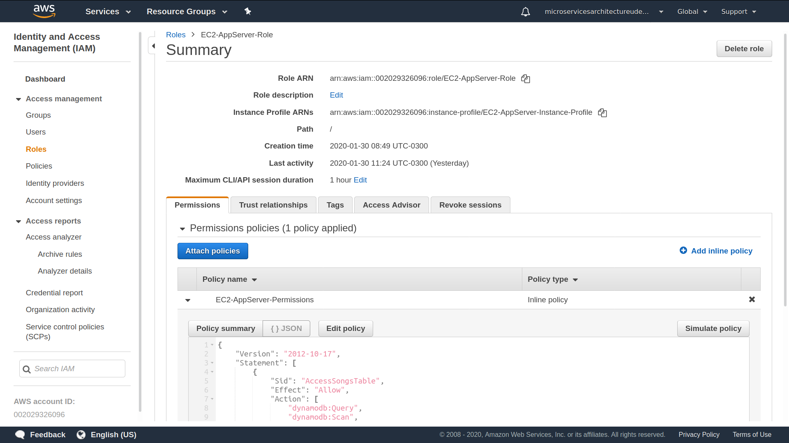


#### Create a Security Group and Allow Inbound Connections for SSH/HTTP

- Execute the following CLI commands:
```
aws ec2 create-security-group --description 'Security group for application servers' --group-name app-server-sg
aws ec2 authorize-security-group-ingress --group-id <security_group_id> --protocol tcp --port 22 --cidr 0.0.0.0/0
aws ec2 authorize-security-group-ingress --group-id <security_group_id> --protocol tcp --port 8080 --cidr 0.0.0.0/0
```

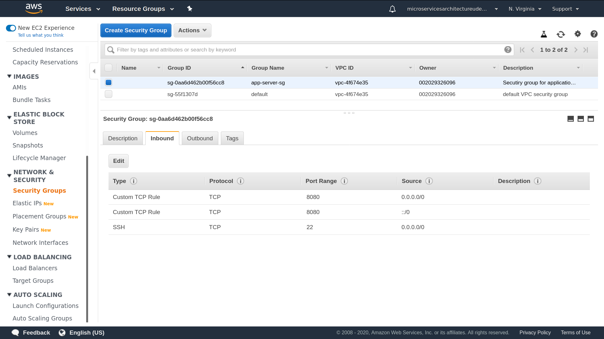


#### Create EC2 Instance

- Using an AMI image that contains Java 8 + Maven

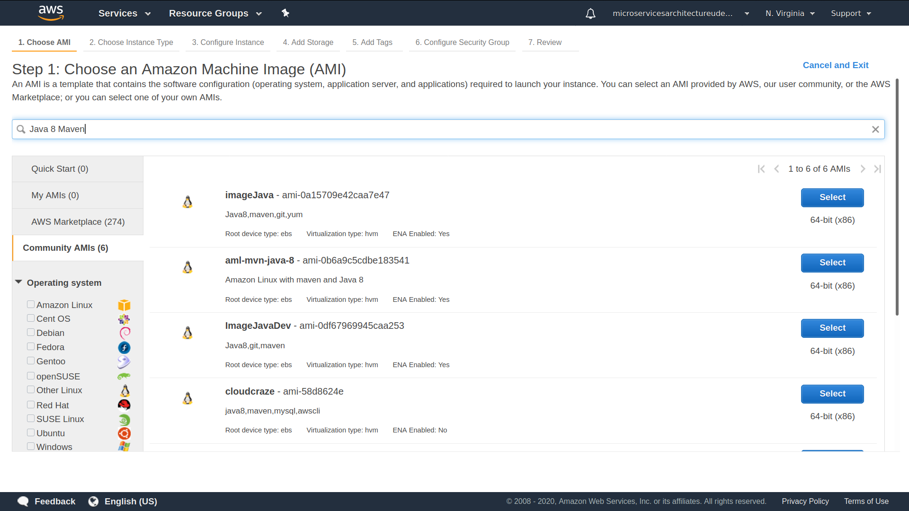


- Using the security group and the IAM role we previously created


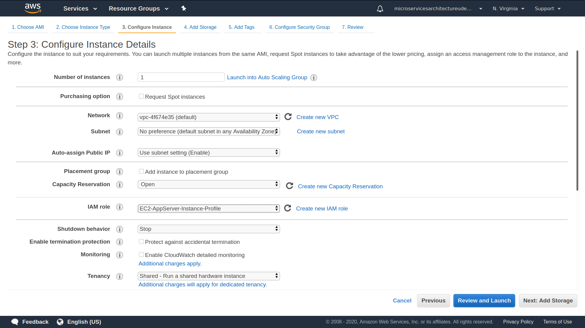


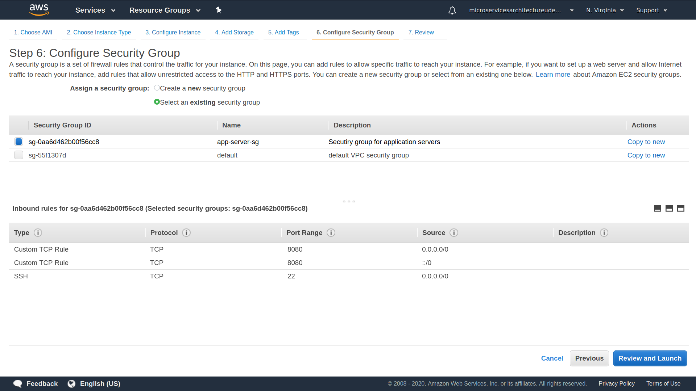


Before we launch the instance, we should acknowledge that we will use the Key Pair that we've created previously.


#### Create the DynamoDB Table
```
aws dynamodb create-table --table-name songs --key-schema AttributeName=id,KeyType=HASH --attribute-definitions AttributeName=id,AttributeType=S --provisioned-throughput ReadCapacityUnits=100,WriteCapacityUnits=100
```

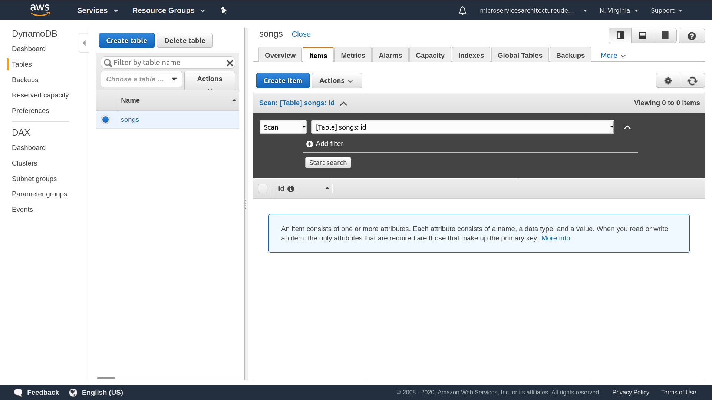


#### Copy the Application to the Server
```
scp -r -i EC2_instance_key.pem <folder_to_the_application_locally>  ec2-user@<ec2_domain_name>:/home/ec2-user
```


#### Connect to the Server with SSH
```
ssh -i EC2_instance_key.pem ec2-user@<ec2_domain_name>
```

#### Deploy the Application to the Server (with Production Profile)
```
cd application_folder
mvn clean install
mvn tomcat7:run -Dspring.profiles.active=prod
```

The application is available in the location http://<ec2_domain_name>:8080/


### Testing in Production

- POST

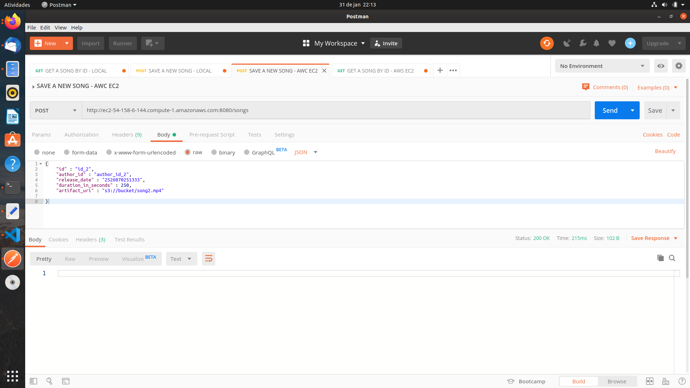


- GET

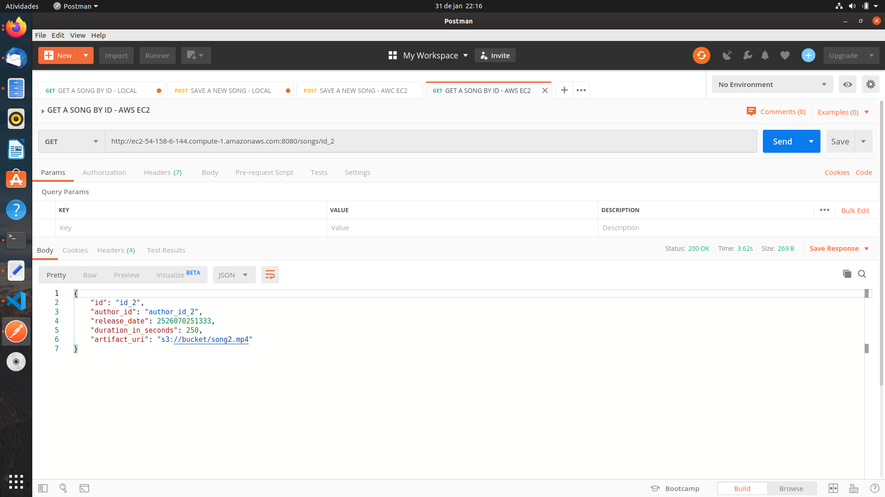


- Check the DynamoDB Table Data


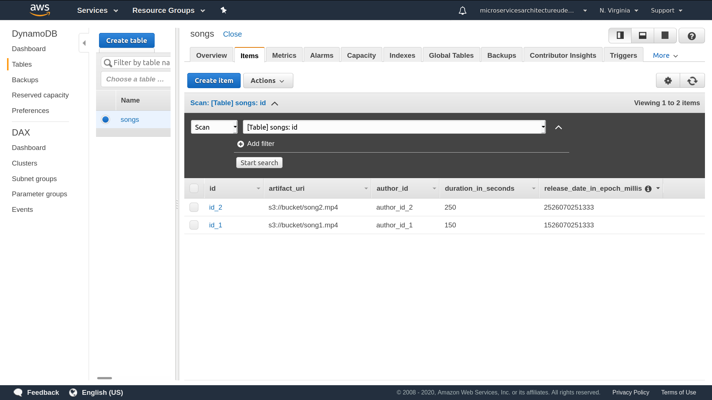


